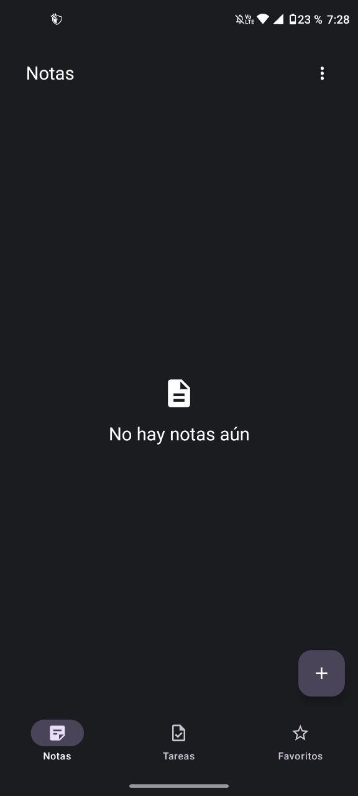
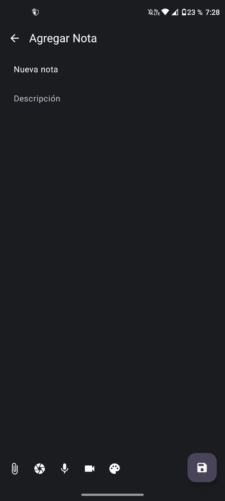
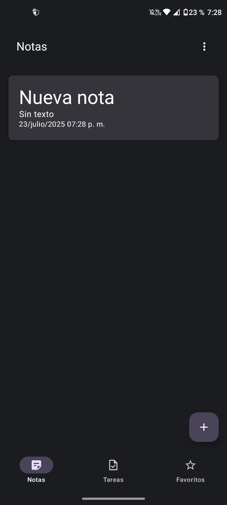
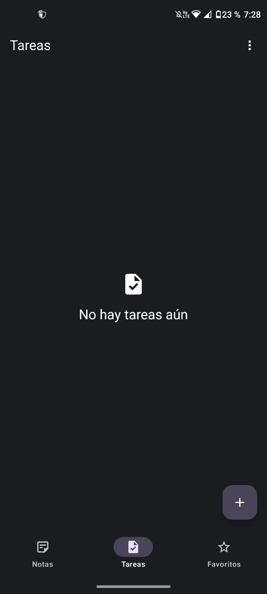
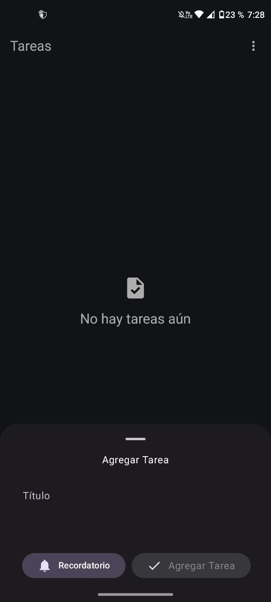
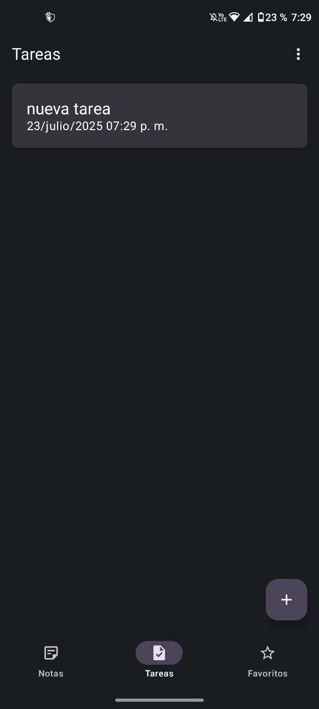

<div align="center">
    
  <h1>NotasApp 📓</h1>
  <p>Developed by <a href="https://github.com/AngelZR17">AngelZR17</a></p>
</div>

___

## 📲 Instalación
1. Clona el repositorio:
   ```bash
   git clone https://github.com/AngelZR17/AppNotas.git
3. Ábrirlo con Android Studio.
4. Conecta un dispositivo o emulador y ejecuta la app.

O bien descarga una version de lanzamiento para instalar el apk directamente en tu dispositivo
___
## 🖼️ Screenshots
### Notas
<p align="center">
  
  
  
</p>

### Tareas
<p align="center">
  
  
  
</p>

